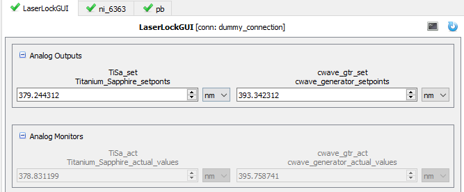

# RaX-labscript

## Overview
This repository contains the userlib folder for the RaX experiment and serves as a central location for updates to the labscript suite developed by the RaX team.

The RaX team is actively working on improvements and new features for labscript. These additions are currently being tested before looking to integrate them into the main labscript project.

This README provides a brief overview of our key features and improvements. Each section includes links to more detailed information and source code for those interested in further exploration or implementation.

## BLACS
The main improvement was to optimize the performance of BLACS by reducing overhead between experimental shots, particularly when we want to process a large sequence. While the labscript suite is very well-developed, user-friendly, and supports all general workflows, optimizing this specific workflow can significantly improve efficiency during high-throughput experimental sequence runs.

The key areas of BLACS identified for potential improvements are:

1. **State Machine**: Streamlining state transitions to minimize latency.
2. **Reliance on QT Main Thread**: Reducing dependency on the main thread to prevent bottlenecks.
3. **Worker Processes**: Enhancing the efficiency of worker processes to better handle concurrent tasks.

More details, along with the BLACS fork can be found at https://github.com/shafinulh/blacs.

### Performance Improvements Overview

The following demonstration visualizes the overall impact of the optimizations. Each GIF shows BLACS executing 20 experimental shots queued up from Runmanager, each 25ms long. These experiments utilize 3 National Instrument IO cards outputting Analog and Digital signals and collecting Analog inputs at maximum sampling rates.

    
    
    

*BLACS state machine operating at **2.27Hz**, **5.66Hz**, and **6.50Hz** for `default_labscript`, `master`, and `performance_hacks` branches of shafinulh/blacs respectively.*

**Branch Descriptions:**
- `default_labscript`: Most up-to-date official branch
- `master`: Includes all changes described in the *shafinulh/blacs* documentation
- `performance_hacks`: All `master` changes plus optimizations discussed in section 4

Note: the functionality and output remain identical across all three branches.

## labscript-utils

Added the *Fast Analog Data Monitor* feature aimed to provide a more flexible and user-friendly interface for visualizing raw analog input data in real-time (faster than waiting and processing in lyse).

### Fast Analog Data Monitor Features Overview
* Stream and plot multiple analog signals in real-time on the same plot window
* Flexible plotting options - multiple signals on same or separate plots, allowing you to define each plot title
* Automatic support for both manual (continuous) and buffered (shot-based) data collection
* Ideal for immediate data inspection and monitoring during experiments

  <em><strong>The plotting window with either both signals on same plot [top] or signals on separate plots [bottom]</strong></em>

  <em><strong>Buffered acquisition displaying raw data from an entire shot, immediately after shot completion</strong></em>

The labscript-devices fork can be found at https://github.com/shafinulh/labscript-utils

## labscript-devices

We've updated several device drivers to align with our recent labscript suite enhancements:

- NI-DAQ cards
- Pseudoclocks (Pulse, Pine, Prawn)

Key changes include:
1. Compatibility with the new BLACS state machine
2. Support for QT_main-independent BLACS backend
3. Integration with new features like the Fast Analog Data Monitor

These updates serve as examples for adapting other devices to our enhanced labscript environment. You can use our changes for the device listed above or can use them as a guide for modifying your own devices.

The labscript-devices fork can be found at https://github.com/shafinulh/labscript-devices

## userlib/user_devices

### RemoteControl of Exisiting Software
The **RemoteControl** device for labscript is designed to provide manual and buffered control over pre-existing GUI applications. This integration removes the need to recreate complex GUIs within labscript, which can be time-consuming and complex.The RemoteControl device tab has two main features:

1. **RemoteAnalogOut**: Allows you to control analog outputs in your remote application.
2. **RemoteAnalogMonitor**: Continuously receive and update the BLACS tab to reflect remote values using a publish-subscribe architecture.

  <em><strong>Remote laser locking system featuring two LabVIEW-controlled lasers with adjustable set points via BLACS tab or per-shot programming. Also have corresponding real-time frequency monitoring through Analog Monitors.</strong></em>

### Nuvu Camera labscript-device
Implemented Nuvu Camera python drivers, to be documented later.
