# Flowchart — calibration-affine

**Purpose:** Map target-space plot coordinates to motor-space via least-squares fitted 2x2 affine matrix M and 2-vector offset b, persisted to JSON, enabling raster motion commands to hit intended laser spots.

```mermaid
flowchart TD
    A["User clicks Calibrate<br/>ui.py:1043-1045<br/>_enter_calibration_mode"] --> B["Set _mode=calibrate<br/>ui.py:1044"]
    B --> C["controller.start_calibration<br/>raster_controller.py:620-626"]
    C --> D["Create CalibrationSession<br/>raster_controller.py:622<br/>required_points=3"]
    D --> E["Emit calibration_prompt_signal<br/>raster_controller.py:623"]
    
    E --> F["User jogs beam to spot 1<br/>Clicks laser in plot<br/>ui.py:244-271<br/>_on_plot_click"]
    F --> G{"self._mode<br/>=='calibrate'?<br/>ui.py:264"}
    G -->|Yes| H["controller.add_calibration_click<br/>x,y target space<br/>raster_controller.py:633-668"]
    
    H --> I["Guard: motors not moving<br/>raster_controller.py:646-654<br/>Check is_moving"]
    I --> J["request_pos source=internal<br/>wait=True timeout=2s<br/>raster_controller.py:657<br/>Force fresh motor read"]
    J --> K["sess.add_pair<br/>target_xy motor_xy<br/>raster_controller.py:663<br/>CalibrationSession:182-184"]
    K --> L["Emit calibration_progress_signal<br/>n=1 required=3<br/>raster_controller.py:665"]
    
    L --> M["Repeat: jog to spot 2,3<br/>Click laser spot 2<br/>H-L loop continues"]
    M --> N["sess.add_pair repeat<br/>n=2 required=3"]
    N --> O["Click laser spot 3<br/>H-L loop continues"]
    O --> P["sess.add_pair n=3<br/>raster_controller.py:663"]
    P --> Q{"sess.is_ready<br/>n >= required_points<br/>raster_controller.py:191-192"}
    Q -->|No| M
    Q -->|Yes| R["_finish_calibration<br/>raster_controller.py:671"]
    
    R --> S["sess.fit_affine<br/>raster_controller.py:678<br/>CalibrationSession:194-244"]
    S --> T["Build A matrix 2Nx6<br/>raster_controller.py:206-215<br/>Each point i:<br/>row 2i: x_i y_i 1 0 0 0<br/>row 2i+1: 0 0 0 x_i y_i 1"]
    T --> U["Build b vector 2N<br/>raster_controller.py:208-215<br/>b[2i] = mx_i<br/>b[2i+1] = my_i"]
    U --> V["np.linalg.lstsq A,b<br/>raster_controller.py:217<br/>Solve for params[6]<br/>a,b,tx,c,d,ty"]
    V --> W["Extract M matrix<br/>raster_controller.py:220-221<br/>M = [[params[0] params[1]]<br/>    [params[3] params[4]]]"]
    W --> X["Extract b_offset<br/>raster_controller.py:222<br/>b = [params[2] params[5]]"]
    X --> Y["Compute diagnostics<br/>raster_controller.py:224-241<br/>rank singular_values<br/>residuals cond_A<br/>triangle_area2_first3"]
    Y --> Z["AffineCalibration M,b<br/>raster_controller.py:243<br/>Post-init caches _Minv<br/>via np.linalg.inv M<br/>raster_controller.py:158"]
    Z --> AA["Check degeneracy<br/>raster_controller.py:684-687<br/>If area2 < 1e-6"]
    AA -->|Degenerate| AB["calibration_failed_signal<br/>raster_controller.py:686"]
    AA -->|Valid| AC["set_calibration cal<br/>raster_controller.py:689"]
    
    AC --> AD["save_calibration_to_path<br/>raster_controller.py:698-704<br/>Auto-save default path"]
    AD --> AE["Open calibration_data.json<br/>raster_controller.py:818<br/>Write JSON bundle<br/>raster_controller.py:807-817"]
    AE --> AF["JSON schema:<br/>calibration_matrix M.tolist<br/>calibration_offset b.tolist<br/>user_home backlash<br/>camera_settings saved_at notes"]
    AF --> AG["save_last_calibration_path<br/>raster_controller.py:820<br/>Write last_calibration_state.json<br/>raster_controller.py:48-50"]
    
    AG --> AH["Emit calibration_ready_signal<br/>cal AffineCalibration<br/>raster_controller.py:709"]
    AH --> AI["UI _on_calibration_ready<br/>ui.py:1518-1533<br/>cal=AffineCalibration"]
    AI --> AJ["Populate matrix display<br/>ui.py:1525-1530<br/>matrix_11=M[0,0]<br/>matrix_12=M[0,1]<br/>matrix_21=M[1,0]<br/>matrix_22=M[1,1]<br/>offset_a=b[0]<br/>offset_b=b[1]"]
    AJ --> AK["Set _mode=normal<br/>ui.py:1533"]
    
    AK --> AL["Later: Start Raster<br/>ui.py:744 1003-1037"]
    AL --> AM["controller.start_raster<br/>Check calibration set<br/>raster_controller.py:885-887"]
    AM --> AN["Enqueue raster points<br/>target_xy from path<br/>raster_controller.py:1541-1547"]
    AN --> AO["_motor_worker_loop dequeues<br/>MOVE_TARGET command<br/>raster_controller.py:1068-1096"]
    AO --> AP["_execute MOVE_TARGET<br/>raster_controller.py:1282-1369<br/>Get target_xy from payload"]
    AP --> AQ{"self.calibration<br/>is not None<br/>raster_controller.py:1306"}
    AQ -->|Yes| AR["cal.target_to_motor<br/>raster_controller.py:1333<br/>mx,my = cal.target_to_motor<br/>target_xy[0] target_xy[1]"]
    AQ -->|No| AS["Passthrough uncalibrated<br/>raster_controller.py:1308<br/>motor_xy = target_xy"]
    AR --> AT["target_to_motor formula<br/>raster_controller.py:160-162<br/>v = M @ [x,y] + b<br/>motor_xy = float v[0] v[1]"]
    AT --> AU["Apply bounds checks<br/>raster_controller.py:1322-1345<br/>target_bounds motor_bounds"]
    AU --> AV["motor_x.move_to mx<br/>motor_y.move_to my<br/>raster_controller.py:1349-1350"]
    AS --> AU
    
    AV --> AW["Read motor position<br/>mx2,my2 get_position<br/>raster_controller.py:1353"]
    AW --> AX["Cache motor position<br/>raster_controller.py:1354-1355"]
    AX --> AY["motor_to_target via<br/>inverse affine<br/>raster_controller.py:1133<br/>invM = cal._Minv cached<br/>raster_controller.py:158"]
    AY --> AZ["motor_to_target formula<br/>raster_controller.py:164-166<br/>v = invM @ mx,my - b<br/>target_xy = float v[0] v[1]"]
    AZ --> BA["Return MotorResult<br/>motor_xy target_xy<br/>raster_controller.py:1369"]
    BA --> BB["Emit motor_position_signal<br/>target_position_signal<br/>raster_controller.py:1413-1415"]
    
    AB --> AC_err["_on_calibration_failed<br/>ui.py:1535-1537<br/>Log msg set _mode=normal"]
```

## Side effects
- Write to calibration_data.json on disk during auto-save (raster_controller.py:818-819)
- Write to last_calibration_state.json breadcrumb file (raster_controller.py:75-76)
- Cache _Minv inverse matrix in AffineCalibration instance (raster_controller.py:158)
- Update controller.calibration shared state (raster_controller.py:728)
- Emit Qt signals: calibration_prompt_signal calibration_progress_signal calibration_ready_signal calibration_failed_signal (raster_controller.py:276-279, 623-626, 665, 709, 680, 659)
- Emit status_signal with scale and condition number info (raster_controller.py:722-724)
- Update UI display fields matrix_11 matrix_12 matrix_21 matrix_22 offset_a offset_b (ui.py:1525-1530)
- Block motor thread via request_pos wait=True during click collection (raster_controller.py:657)
- Block motor FIFO via _read_motor_backlash_xy wait=True during save (raster_controller.py:798)
- Publish calibration_status PUB topic to ZMQ subscribers (raster_controller.py:1645-1646)

## External deps
- numpy.linalg.lstsq() for least-squares matrix solve (raster_controller.py:217)
- numpy.linalg.inv() for affine inverse (raster_controller.py:158)
- Motor I/O thread request_pos() for fresh motor position reads (raster_controller.py:657)
- Motor DLL get_position() set_backlash() get_backlash() via motor objects (raster_controller.py:1122-1124, 798)
- PyQt5 signals QObject.pyqtSignal() for calibration lifecycle (raster_controller.py:29, 276-279)
- PyQt5 file dialogs for save/load (ui.py:1366-1368, 1388-1390)
- JSON encoder/decoder for persistence (raster_controller.py:61, 819)
- os.path functions for file management (raster_controller.py:48-50, 63, 818)
- RasterSpec iter_path_from_spec() for raster generation (ui.py:26, 952, 1016)

## Sources read
- raster_controller.py:40-83 (module constants and last-calibration path helpers)
- raster_controller.py:145-174 (AffineCalibration dataclass)
- raster_controller.py:176-244 (CalibrationSession dataclass and fit_affine method)
- raster_controller.py:276-279 (calibration signals)
- raster_controller.py:304-310 (calibration state fields)
- raster_controller.py:620-668 (start_calibration and add_calibration_click methods)
- raster_controller.py:671-724 (_finish_calibration and set_calibration methods)
- raster_controller.py:726-744 (clear_calibration and property is_raster_running)
- raster_controller.py:753-774 (_read_motor_backlash_xy for bundled save)
- raster_controller.py:776-871 (save_calibration_to_path and load_calibration_from_path)
- raster_controller.py:1126-1138 (_read_and_cache_position helper)
- raster_controller.py:1282-1369 (_execute method MOVE_TARGET branch with target_to_motor)
- raster_controller.py:1645-1646 (ZMQ PUB calibration_status topic)
- ui.py:244-271 (_on_plot_click with calibrate mode dispatch)
- ui.py:1043-1062 (_enter_calibration_mode and _reset_calibration_display)
- ui.py:1512-1537 (calibration progress/ready/failed signal handlers)
- ui.py:1356-1430 (named-file calibration save/load and bundled camera settings)
- calibration_data.json (example persistent JSON with schema)

## Confidence
High. All entry points traced directly from source. AffineCalibration and CalibrationSession are explicit dataclasses with clear methods. Least-squares fit (fit_affine) uses numpy.linalg.lstsq directly. Transform use (target_to_motor, motor_to_target) verified in every motion command path (_execute MOVE_TARGET at lines 1333, 1133). Persistence (save/load) traced to JSON file I/O. Signal emissions verified at call sites. UI bindings (_on_calibration_ready, _on_plot_click) are direct handlers. Live operator checkout confirms the feature works end-to-end.

## Gaps
- Error recovery: if fit_affine raises ValueError (singular M), UI does not auto-retry or offer incremental refinement with additional points
- Numerical stability: condition number and singular values are computed but no automatic threshold warning is enforced
- Multi-user scenarios: no distributed locking if two BLACS agents or two GUI instances try to calibrate simultaneously on the same motor hardware
- Camera-settings bundling: passed as opaque dict (ui.py:1377, raster_controller.py:814); schema is not validated or versioned
- Display transforms: rotation_k flip_x flip_y are applied to image rendering but NOT integrated into the affine; target-space is always pixel-aligned
- Online recalibration: once fitted, M is fixed until next full calibration; no incremental refinement with additional points during raster runs
- Singular matrix handling: if inv(M) fails, motor_to_target would raise; fallback to uncalibrated is not implemented
