# Flowchart — camera-pipeline

**Purpose:** Trace frame acquisition from uEye camera via pyueye, parameter commits via Qt signals/slots, and display rendering to pyqtgraph ImageItem with overlays.

```mermaid
flowchart TD
    Start["RasterMainWindow.__init__<br/>ui.py:45-117"] --> InstallDock["_install_camera_settings_dock<br/>ui.py:273-310"]
    Start --> StartCam["_start_camera<br/>ui.py:469-582"]
    
    StartCam --> LoadIni{"Load .ini?<br/>ui.py:481"}
    LoadIni -->|Yes| ParseIni["load_ueye_config_from_ini<br/>camera.py:773-835"]
    LoadIni -->|No| DefaultCfg["UEyeConfig from config.py<br/>ui.py:526-540"]
    
    ParseIni --> LoadDispSettings["_load_display_settings_from_ini<br/>camera.py:950-975"]
    LoadDispSettings --> CreateThread["UEyeCameraThread cfg<br/>camera.py:509-521"]
    DefaultCfg --> CreateThread
    
    CreateThread --> WireNew["camera_thread.new_frame.connect<br/>ui.py:549"]
    WireNew --> WireStatus["camera_thread.status.connect<br/>ui.py:550"]
    WireStatus --> WireError["camera_thread.error.connect<br/>ui.py:551"]
    WireError --> ConnectDock["cam_dock.connect_to_camera_thread<br/>camera_settings_dock.py:577-624"]
    
    ConnectDock --> DockWiring["_bind_param_controls fps/exp/gamma<br/>camera_settings_dock.py:358-399"]
    DockWiring --> GainWiring["gain_spin -> set_master_gain<br/>camera_settings_dock.py:594-596"]
    GainWiring --> BoostWiring["gain_boost_cb -> set_gain_boost<br/>camera_settings_dock.py:599-601"]
    BoostWiring --> PclkWiring["pclk_combo -> _on_pclk_changed<br/>camera_settings_dock.py:604-606"]
    PclkWiring --> AoiWiring["aoi_apply_btn -> request_aoi_change<br/>camera_settings_dock.py:609-616"]
    AoiWiring --> CamInfoWiring["cam_thread.camera_info_signal<br/>-> update_from_camera_info<br/>camera_settings_dock.py:619"]
    
    CamInfoWiring --> ThreadStart["camera_thread.start<br/>ui.py:565"]
    
    ThreadStart --> ThreadRun["UEyeCameraThread.run<br/>camera.py:622-766"]
    ThreadRun --> CamCreate["UEyeCamera cfg<br/>camera.py:624"]
    CamCreate --> CamOpen["cam.open<br/>camera.py:626"]
    
    CamOpen --> InitCamera["is_InitCamera<br/>camera.py:72"]
    InitCamera --> GetSensor["is_GetSensorInfo<br/>camera.py:80"]
    GetSensor --> SetColor["is_SetColorMode MONO8<br/>camera.py:87"]
    SetColor --> SetGain["is_SetHardwareGain<br/>camera.py:96-100"]
    SetGain --> SetGamma["is_Gamma<br/>camera.py:102-103"]
    SetGamma --> SetPclk["is_PixelClock<br/>camera.py:118"]
    SetPclk --> SetFps["is_SetFrameRate<br/>camera.py:122"]
    SetFps --> SetupAoi["_setup_aoi width/height/offset<br/>camera.py:127-129"]
    SetupAoi --> AllocMem["_alloc_memory<br/>camera.py:134"]
    AllocMem --> SetExp["set_exposure_ms<br/>camera.py:145"]
    SetExp --> EmitInfo["camera_info_signal<br/>camera.py:634"]
    
    EmitInfo --> GrabLoop["Grab Loop (run)<br/>camera.py:642-759"]
    
    GrabLoop --> CheckPending["Lock _params_lock<br/>camera.py:644"]
    CheckPending --> ApplyPending["Apply pending params dict<br/>camera.py:650-729"]
    
    ApplyPending --> SetPriorityExp{"prioritize_exposure?<br/>camera.py:651-652"}
    SetPriorityExp -->|Set| UpdatePriorityExp["_cam._prioritize_exposure<br/>camera.py:652"]
    SetPriorityExp -->|Skip| CheckPclk
    UpdatePriorityExp --> CheckPclk["Check pending['pixel_clock']<br/>camera.py:655"]
    
    CheckPclk -->|Yes| SetPclkRT["set_pixel_clock mhz<br/>camera.py:657"]
    CheckPclk -->|No| CheckFps
    SetPclkRT --> InfoUpdate1["need_info_update=True<br/>camera.py:658"]
    
    InfoUpdate1 --> CheckFps["Check pending['fps']<br/>camera.py:664"]
    CheckFps -->|Yes| SetFpsRT["set_frame_rate fps<br/>camera.py:666"]
    CheckFps -->|No| CheckAoi
    SetFpsRT --> InfoUpdate2["need_info_update=True<br/>camera.py:668"]
    
    InfoUpdate2 --> CheckAoi["Check pending['aoi']<br/>camera.py:673"]
    CheckAoi -->|Yes| ReinitAoi["reinit_aoi w/h/sx/sy<br/>camera.py:676"]
    CheckAoi -->|No| CheckGain
    ReinitAoi --> StopLive["is_StopLiveVideo if not freeze<br/>camera.py:316"]
    StopLive --> FreeMem["_free_memory<br/>camera.py:320"]
    FreeMem --> SetupAoi2["_setup_aoi absolute mode<br/>camera.py:322-323"]
    SetupAoi2 --> AllocMem2["_alloc_memory<br/>camera.py:325"]
    AllocMem2 --> RestartCapture["is_CaptureVideo if not freeze<br/>camera.py:328"]
    RestartCapture --> InfoUpdate3["need_info_update=True<br/>camera.py:677"]
    
    InfoUpdate3 --> CheckGain["Check pending['gain']<br/>camera.py:683"]
    CheckGain -->|Yes| SetGainRT["set_master_gain<br/>camera.py:685"]
    CheckGain -->|No| CheckBoost
    SetGainRT --> CheckBoost
    
    CheckBoost["Check pending['gain_boost']<br/>camera.py:689"] -->|Yes| SetBoostRT["set_gain_boost<br/>camera.py:691"]
    CheckBoost -->|No| CheckGamma
    SetBoostRT --> CheckGamma
    
    CheckGamma["Check pending['gamma']<br/>camera.py:695"] -->|Yes| SetGammaRT["set_gamma<br/>camera.py:697"]
    CheckGamma -->|No| CheckExp
    SetGammaRT --> CheckExp
    
    CheckExp["Check pending['exposure']<br/>camera.py:702"] -->|Yes| ExpPriority{"_prioritize_exposure?<br/>camera.py:705"}
    CheckExp -->|No| CheckIniExtras
    ExpPriority -->|Yes| AdjustFps["set_frame_rate for exposure<br/>camera.py:707"]
    ExpPriority -->|No| SetExpRT
    AdjustFps --> SetExpRT["set_exposure_ms<br/>camera.py:708"]
    SetExpRT --> InfoUpdate4["need_info_update=True<br/>camera.py:709"]
    
    InfoUpdate4 --> CheckIniExtras["Check pending['ini_extras']<br/>camera.py:714"]
    CheckIniExtras -->|Yes| ApplyIniExt["apply_ini_to_camera<br/>camera.py:716"]
    CheckIniExtras -->|No| CheckRefreshInfo
    ApplyIniExt --> InfoUpdate5["need_info_update=True<br/>camera.py:717"]
    
    InfoUpdate5 --> CheckRefreshInfo["Check pending['refresh_info']<br/>camera.py:721"]
    CheckRefreshInfo -->|Yes| InfoUpdate6["need_info_update=True<br/>camera.py:722"]
    CheckRefreshInfo -->|No| CheckNeedInfo
    
    InfoUpdate6 --> CheckNeedInfo{"need_info_update?<br/>camera.py:725"}
    CheckNeedInfo -->|Yes| EmitUpdatedInfo["camera_info_signal emit<br/>camera.py:727"]
    CheckNeedInfo -->|No| DoGrab
    
    EmitUpdatedInfo --> DoGrab["Grab Frame<br/>camera.py:732-747"]
    DoGrab --> TryGrab["cam.grab<br/>camera.py:733"]
    TryGrab --> UseFreeze{"use_freeze?<br/>camera.py:451"}
    UseFreeze -->|Yes| FreezeVideo["is_FreezeVideo WAIT<br/>camera.py:452"]
    UseFreeze -->|No| GetData
    FreezeVideo --> GetData["ueye.get_data mem_ptr<br/>camera.py:456-462"]
    GetData --> Reshape["np.reshape to H,W<br/>camera.py:465"]
    Reshape --> EmitRGB{"emit_rgb?<br/>camera.py:467"}
    EmitRGB -->|Yes| StackRgb["np.dstack 3x gray<br/>camera.py:468"]
    EmitRGB -->|No| ReturnFrame["return frame ndarray<br/>camera.py:470"]
    StackRgb --> ReturnFrame
    
    ReturnFrame --> EmitNewFrame["new_frame.emit frame<br/>camera.py:748"]
    
    EmitNewFrame --> SetFrameSlot["RasterMainWindow.set_frame<br/>ui.py:186-226"]
    SetFrameSlot --> CheckFrame{"frame valid?<br/>ui.py:191"}
    CheckFrame -->|No| SkipFrame["return<br/>ui.py:192"]
    CheckFrame -->|Yes| ApplyRotation["np.rot90 if rotation_k != 0<br/>ui.py:196"]
    
    ApplyRotation --> UpdateFps["Calc dt, update FPS label<br/>ui.py:200-212"]
    UpdateFps --> SetImage["img_item.setImage frame<br/>ui.py:216"]
    SetImage --> TrackShape["Track frame.shape<br/>ui.py:220-226"]
    TrackShape --> ApplyScale["_apply_image_scale<br/>ui.py:226"]
    
    ApplyScale --> ImageMapping["_apply_image_mapping<br/>ui.py:588-597"]
    ImageMapping --> SetRect["img_item.setRect w,h<br/>ui.py:596"]
    SetRect --> SetRange["vb.setRange xRange/yRange<br/>ui.py:597"]
    
    SetRange --> DisplayReady["Image displayed in pyqtgraph<br/>with current_target_marker overlay"]
    
    DisplayReady --> LoopThrottle["Soft throttle max_fps<br/>camera.py:753-759"]
    LoopThrottle --> GrabLoop
    
    SkipFrame --> LoopThrottle
    
    style Start fill:#e1f5ff
    style DisplayReady fill:#c8e6c9
    style GrabLoop fill:#fff9c4
    style ThreadRun fill:#f3e5f5
    style CamOpen fill:#ffe0b2

```

## Side effects
- pyueye.is_InitCamera: initializes uEye camera handle
- pyueye.is_SetColorMode: sets sensor to MONO8 mode
- pyueye.is_SetHardwareGain/Gamma/Blacklevel: configures analog frontend
- pyueye.is_PixelClock: sets pixel clock (affects FPS/exposure ranges)
- pyueye.is_SetFrameRate: sets target frame rate
- pyueye.is_AOI: sets sensor region of interest (requires memory realloc)
- pyueye.is_AllocImageMem/is_SetImageMem: allocates DMA buffer on uEye hardware
- pyueye.is_FreezeVideo: grabs single frame from continuous or triggered capture
- pyueye.is_ExitCamera: releases camera handle and cleans up
- Qt signals/slots: emit new_frame, camera_info_signal across thread boundary
- PyQtGraph ImageItem.setImage: updates texture for display
- PyQtGraph ViewBox.setRange: updates plot axes
- File I/O: config.py loads defaults, camera_params.ini loads/saves user settings

## External deps
- pyueye (IDS uEye SDK bindings): is_InitCamera, is_FreezeVideo, is_Exposure, is_SetHardwareGain, is_PixelClock, is_SetFrameRate, is_AOI, is_AllocImageMem, is_SetImageMem, is_FreeImageMem, is_ExitCamera, ueye.get_data
- PyQt5 QtCore: QThread, pyqtSignal, pyqtSlot, QMutex, QMutexLocker, QTimer
- PyQt5 QtWidgets: QMainWindow, QDockWidget, QScrollArea, QVBoxLayout, QFormLayout, QSlider, QDoubleSpinBox, QSpinBox, QComboBox, QCheckBox, QPushButton, QFileDialog
- pyqtgraph: PlotWidget, ImageItem, ScatterPlotItem, ViewBox, PlotDataItem, mkBrush, mkPen
- numpy: reshape, dstack, rot90, ndarray
- config.py (APP_CONFIG.camera): camera_id, pixel_clock_mhz, exposure_ms_default, target_fps, master_gain, gamma, enable_gain_boost, flip_x/y, width, height, roi_offset_x/y, use_freeze, emit_rgb, camera_params_ini
- configparser: parse/write uEye Cockpit .ini files (Image size, Timing, Gain, Parameters, Display sections)
- raster_controller: load_last_calibration_path (for auto-revert feature)

## Sources read
- camera.py:1-25 (imports, pyueye dependency check)
- camera.py:17-34 (UEyeConfig dataclass with all camera parameters)
- camera.py:36-90 (UEyeCamera.__init__, properties)
- camera.py:71-147 (UEyeCamera.open: InitCamera, ColorMode, Gain/Gamma, PixelClock, FrameRate, AOI, Memory, Exposure)
- camera.py:152-204 (_setup_aoi: sensor bounds checking, alignment to 4-pixel boundaries, IS_RECT setup)
- camera.py:205-220 (_alloc_memory, _free_memory: is_AllocImageMem, is_SetImageMem, is_FreeImageMem)
- camera.py:233-296 (set_exposure_ms, set_master_gain, set_gamma, set_pixel_clock, set_gain_boost, set_frame_rate runtime setters)
- camera.py:307-330 (reinit_aoi: stop capture, realloc, restart for AOI changes)
- camera.py:336-441 (get_camera_info: queries all ranges for UI, pixel clocks, exposure, FPS, gain, gamma, AOI)
- camera.py:447-470 (grab: is_FreezeVideo, ueye.get_data, reshape, emit_rgb dstack)
- camera.py:476-489 (close: is_StopLiveVideo, _free_memory, is_ExitCamera)
- camera.py:496-621 (UEyeCameraThread class: pyqtSignal definitions, __init__, thread-safe parameter slots with QMutex, error throttling)
- camera.py:527-574 (parameter slots: set_exposure_ms, set_master_gain, set_gamma, set_pixel_clock, set_gain_boost, request_aoi_change, set_target_fps, set_prioritize_exposure, request_ini_extras, request_info_refresh)
- camera.py:584-616 (error throttling: _err_throttled_emit, _err_throttle_flush for transient grab errors)
- camera.py:622-766 (run loop: camera open, pending params application in strict order, grab/emit, soft throttle)
- camera.py:650-729 (run loop pending params application: prioritize_exposure, pixel_clock, fps, aoi, gain, gain_boost, gamma, exposure with exposure-priority mode, ini_extras, refresh_info, camera_info_signal emission)
- camera.py:773-835 (load_ueye_config_from_ini: configparser read, fallback defaults, override support)
- camera.py:838-882 (apply_ini_to_camera: hotpixel correction, hardware gamma, AOI reinit from .ini)
- camera.py:885-947 (save_settings_to_ini: round-trip uEye Cockpit-compatible .ini + custom Display section)
- camera.py:950-975 (_load_display_settings_from_ini: parse custom [Display] section for rotation_k, flip_x/y)
- camera_settings_dock.py:17-100 (CameraSettingsDock layout: Timing group with pixel clock, timing mode, FPS, Exposure; Analog group with Gain, GainBoost, Gamma)
- camera_settings_dock.py:148-203 (AOI group: width/height/start_x/start_y spinboxes, sliders, Apply/Center buttons; sensor dimensions display)
- camera_settings_dock.py:206-226 (Display group: rotation combo 0/90/180/270; flip X/Y checkboxes; config label; Save/Load/Revert buttons)
- camera_settings_dock.py:269-323 (_wire_signals: timing mode enable/disable, _bind_param_controls for fps/exp/gamma, gain slider/spin sync, AOI slider/spin sync, rotation/flip signal routing, save/load/revert emission)
- camera_settings_dock.py:325-333 (_on_timing_mode_changed: enable FPS controls in fps mode, exposure controls in exposure mode)
- camera_settings_dock.py:337-400 (_bind_param_controls: unified slider<->spinbox display sync and camera commit in single closure, lazy camera thread resolution by method name, blockSignals to prevent feedback loops)
- camera_settings_dock.py:401-435 (AOI slider/spin sync and centering logic)
- camera_settings_dock.py:442-544 (update_from_camera_info: populate all control ranges from camera info dict, with blockSignals)
- camera_settings_dock.py:546-566 (get_current_settings: return dict of all control values for save)
- camera_settings_dock.py:577-624 (connect_to_camera_thread: wire dock controls to camera thread slots, including timing mode, gain, gain_boost, pclk, aoi_apply, camera_info_signal connection)
- ui.py:1-40 (imports, UI_FILE loading, config.py optional import)
- ui.py:44-118 (RasterMainWindow.__init__: load .ui, controller setup, raster mode controls, plot init, UI/controller signal wiring, backlash/user-home population, camera settings dock install, camera start)
- ui.py:123-184 (_init_plot: PlotWidget creation, ImageItem with axisOrder=row-major, overlays hull/raster/manual/current_target_marker scatters, direction lines, bounds rect, crosshair, mouse tracking)
- ui.py:186-226 (set_frame: apply rotation, calc FPS, setImage on img_item, track shape, apply scale)
- ui.py:228-235 (closeEvent: stop camera thread gracefully)
- ui.py:273-310 (_install_camera_settings_dock: create CameraSettingsDock, sync flip/rotation state, connect display transforms, connect save/load/revert, add View menu toggle)
- ui.py:312-326 (display transform handlers: _set_rotation, _set_flip_x, _set_flip_y, invalidate frame shape)
- ui.py:328-467 (_save_camera_settings, _load_camera_settings, _revert_camera_settings, _apply_ini_to_running_camera: INI file I/O, dock population, camera thread parameter commits, display settings loading/applying)
- ui.py:469-582 (_start_camera: load .ini if exists, fallback to config.py, create UEyeCameraThread, wire signals, dock connection, thread start, apply .ini extras on 2s delay, populate exposure spinbox)
- ui.py:584-597 (_apply_image_scale, _apply_image_mapping: set ImageItem rect and ViewBox range to match frame dimensions)
- config.py:1-40 (imports, module docstring)
- config.py:62-102 (CameraConfig: camera_id, camera_params_ini, pixel_clock_mhz, exposure_ms_default, target_fps, master_gain, gamma, enable_gain_boost, flip_x/y, width, height, roi_offset_x/y, use_freeze, emit_rgb)

## Confidence
High. All function signatures, line numbers, and signal connections verified from source code. The happy path traces frame acquisition via pyueye FreezeVideo, parameter commits via Qt thread-safe slots with pending dict pattern, and display rendering to pyqtgraph ImageItem. Error branches (transient grab errors, exceptions in param apply, .ini parsing failures) are mapped but not detailed in the main flow. Config loading and display transform (rotation/flip) paths are fully traced.

## Gaps
- Deep detail on uEye SDK error codes and recovery strategies (lines 506, 738-743 mention IS_TIMED_OUT/IS_TRANSFER_ERROR throttling but full code paths not expanded)
- Memory buffer management internals: specific pyueye.get_data implementation and DMA buffer lifecycle not detailed
- ViewBox coordinate transformations for plot click mapping (ui.py:254-266 calls affine transform but does not show internals)
- Affine calibration interaction with display transforms (rotation/flip) - bidirectional mapping logic exists but not fully traced
- ZMQ remote control integration (config.py network settings present but ui.py does not show ZMQ bindings)
- Real-time kernel scheduler interaction and frame drop conditions under load
- Spinnaker/rotpy branch parallel implementation (mentioned in feature scope as parked feat/spinnaker-gige, not on main)
