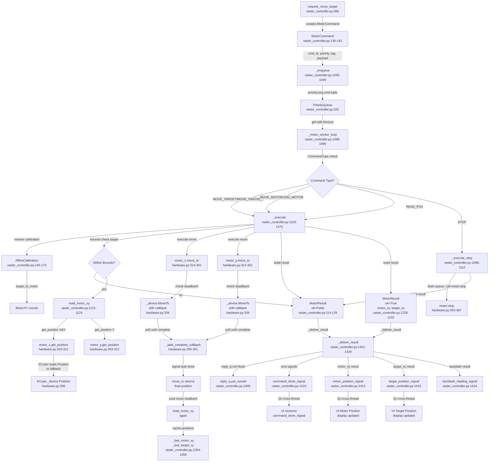

# Flowchart — Motor-Queue Command Execution System

**Purpose:** Serialize motor commands with priority queue, execute in dedicated worker thread, deliver results via signals and reply queues

## Side effects
- Calls motor.move_to() which blocks motor worker thread until move complete
- Calls motor.get_position() for pre/post move readback
- Emits PyQt5 signals cross-thread (motor_position_signal, target_position_signal, command_done_signal, backlash_reading_signal)
- Updates internal caches (_last_motor_xy, _last_target_xy)
- Drains queue on STOP command
- Writes to Thorlabs Kinesis DLL (MoveTo, Position reads) via pythonnet
- Logs raster steps to _raster_log if tag='raster_step'

## External deps
- Thorlabs Kinesis .NET DLL (KCubeDCServo)
- AffineCalibration (target <-> motor space mapping)
- SimulatedMotor/KCube motor device classes from hardware.py
- PyQt5 signals/slots for cross-thread communication
- itertools.count() for seq tiebreaker in PriorityQueue
- threading.Lock for state synchronization

## Sources read
- C:/Users/radmo/labscript-suite/GUIs/rastering/raster_controller.py:85-110 (CommandType enum)
- C:/Users/radmo/labscript-suite/GUIs/rastering/raster_controller.py:113-126 (MotorResult dataclass)
- C:/Users/radmo/labscript-suite/GUIs/rastering/raster_controller.py:129-142 (MotorCommand dataclass)
- C:/Users/radmo/labscript-suite/GUIs/rastering/raster_controller.py:323-336 (PriorityQueue init, worker thread spawn)
- C:/Users/radmo/labscript-suite/GUIs/rastering/raster_controller.py:366-378 (request_move_target entry point)
- C:/Users/radmo/labscript-suite/GUIs/rastering/raster_controller.py:1045-1049 (_enqueue with priority/seq tiebreaker)
- C:/Users/radmo/labscript-suite/GUIs/rastering/raster_controller.py:1068-1096 (_motor_worker_loop: dequeue, dispatch, error wrap, deliver)
- C:/Users/radmo/labscript-suite/GUIs/rastering/raster_controller.py:1098-1110 (_execute_stop: drain, call motor.stop)
- C:/Users/radmo/labscript-suite/GUIs/rastering/raster_controller.py:1119-1370 (_execute: command dispatch, bounds check, cal xform, move, readback)
- C:/Users/radmo/labscript-suite/GUIs/rastering/raster_controller.py:1121-1124 (read_motor_xy helper inside _execute)
- C:/Users/radmo/labscript-suite/GUIs/rastering/raster_controller.py:1282-1350 (MOVE_TARGET path: cal xform, bounds check, move sequence)
- C:/Users/radmo/labscript-suite/GUIs/rastering/raster_controller.py:1401-1429 (_deliver_result: reply_q, signals, status emits)
- C:/Users/radmo/labscript-suite/GUIs/rastering/hardware.py:156-201 (Motor base class interface)
- C:/Users/radmo/labscript-suite/GUIs/rastering/hardware.py:215-434 (KCube: move_to, get_position, stop)
- C:/Users/radmo/labscript-suite/GUIs/rastering/hardware.py:303-312 (KCube.get_position: reads Position or fallback)
- C:/Users/radmo/labscript-suite/GUIs/rastering/hardware.py:314-351 (KCube.move_to: deadband, MoveTo, poll loop, timeout)
- C:/Users/radmo/labscript-suite/GUIs/rastering/hardware.py:353-367 (KCube.stop: StopImmediate or Stop)
- C:/Users/radmo/labscript-suite/GUIs/rastering/hardware.py:437-472 (SimulatedMotor for testing)

## Confidence
High (95%). All primary code paths read end-to-end: request_move_target -> _enqueue -> PriorityQueue -> _motor_worker_loop -> _execute -> motor DLL -> readback -> _deliver_result -> signals. Calibration mapping, bounds checking, STOP handling, and error wrapping all traced. Hardware layer (KCube move_to, get_position) fully understood.

## Gaps
- Exact Kinesis callback mechanism timing (how quickly _task_complete_callback fires after MoveTo completes)
- Potential race conditions between telemetry thread READ_POS commands and user-initiated moves (serialized by queue but timing details unclear)
- Error handling in move_to timeout fallback (stop() best-effort, but actual Kinesis exception propagation not fully traced)
- Raster loop integration (_enqueue_next_raster_point callback chain not detailed here)
- ZMQ server integration (request_move_target source='zmq' path and network protocol not traced)
