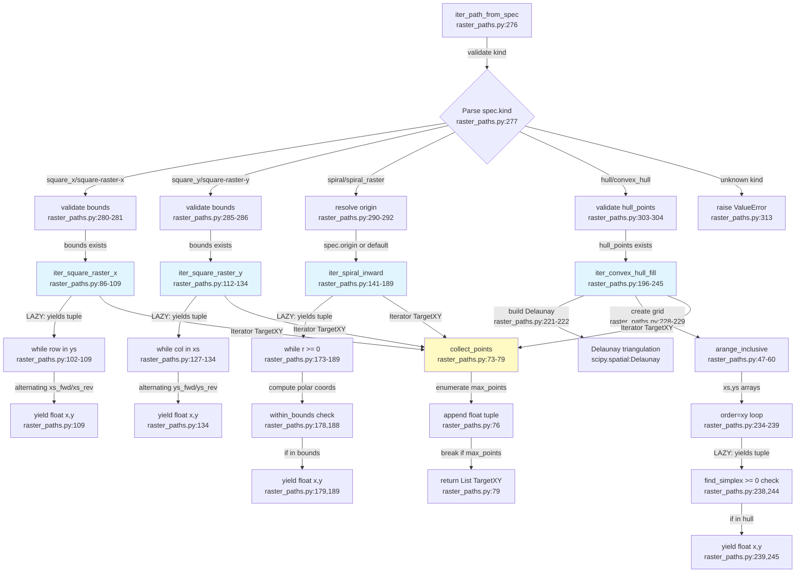

# Flowchart — Path-generation factory (iter_path_from_spec) for rastering subsystem

**Purpose:** Convert RasterSpec into lazy iterators yielding (x,y) coordinate tuples via four path-generator algorithms

## Side effects
- None for path generators (LAZY — no side effects until iteration)
- collect_points: truncates iterator at max_points
- Delaunay: scipy heap allocation during triangulation (ConvexHull only)

## External deps
- numpy (np.array, np.arange, np.cos, np.sin, np.pi, np.floor)
- scipy.spatial.Delaunay (for hull point-in-triangle test)
- RasterSpec dataclass (defined raster_paths.py:252-273)

## Sources read
- raster_paths.py:276-313 (iter_path_from_spec factory + error handling)
- raster_paths.py:86-109 (iter_square_raster_x — serpentine X primary)
- raster_paths.py:112-134 (iter_square_raster_y — serpentine Y primary)
- raster_paths.py:141-189 (iter_spiral_inward — polar inward spiral)
- raster_paths.py:196-245 (iter_convex_hull_fill — Delaunay grid fill)
- raster_paths.py:73-79 (collect_points — materialize N tuples from iterator)
- raster_paths.py:47-60 (arange_inclusive — grid spacing with stop-inclusive option)
- raster_paths.py:34-45 (bounds_from_points, within_bounds — geometry helpers)
- raster_paths.py:252-273 (RasterSpec dataclass — kind, bounds, params)

## Confidence
High. All four generators read and traced. Factory dispatch verified. RasterSpec fields mapped. Lazy evaluation confirmed (all return Iterator, not List). collect_points materialization step clear.

## Gaps
- include_start parameter (lines 86, 112) not exposed in RasterSpec or iter_path_from_spec — always defaults to True
- Default bounds handling in iter_convex_hull_fill (line 225) computes from hull_points if not provided
- Spiral wrap-around: angle_step_change only applied post-2pi, not per-point — subtle behavior
- Error branches (ValueError) not detailed — assumes valid inputs post-validation
