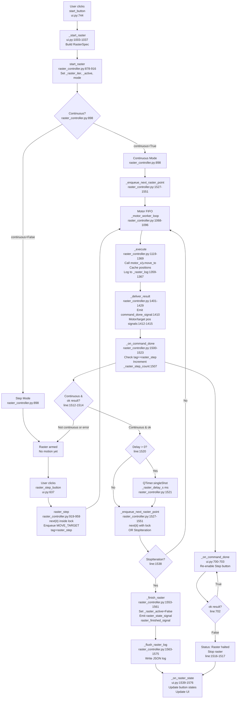

# Flowchart — Raster run-loop with continuous and single-step modes

**Purpose:** Enable automatic scanning of a target-space path with configurable continuous or manual stepping, logging each move and synchronized via Qt signal chaining

## Side effects
- Motor move_to() calls (motor_x, motor_y DLL access via dedicated worker thread)
- Command queue operations (PriorityQueue enqueue/dequeue)
- Position caching (_last_motor_xy, _last_target_xy)
- Raster logging to _raster_log list and JSON file write on finish
- Qt signals emitted (command_done_signal, motor_position_signal, target_position_signal, raster_state_signal, raster_finished_signal)
- QTimer.singleShot for continuous-mode delay between points
- Threading: motor_worker_loop thread dequeues commands, GUI thread chains via _on_command_done
- State mutations under _state_lock (_raster_active, _raster_continuous, _raster_step_count, _raster_iter)

## External deps
- raster_paths.RasterSpec, iter_path_from_spec, collect_points (path generation)
- PyQt5 signals/slots (command_done_signal, raster_state_signal, status_signal)
- QTimer for async delays
- Motor hardware interface (motor_x.move_to, motor_y.move_to)
- numpy (position transforms)
- json (log serialization)
- threading (locks, worker thread coordination)

## Sources read
- raster_controller.py:878-916 (start_raster init)
- raster_controller.py:919-959 (raster_step)
- raster_controller.py:1068-1096 (_motor_worker_loop)
- raster_controller.py:1119-1369 (_execute)
- raster_controller.py:1359-1367 (raster logging)
- raster_controller.py:1401-1429 (_deliver_result)
- raster_controller.py:1500-1523 (_on_command_done)
- raster_controller.py:1527-1551 (_enqueue_next_raster_point)
- raster_controller.py:1553-1561 (_finish_raster)
- raster_controller.py:1563-1575 (_flush_raster_log)
- ui.py:676-698 (_step_raster)
- ui.py:700-704 (_on_command_done)
- ui.py:1003-1037 (_start_raster)
- ui.py:1539-1576 (_on_raster_state)

## Confidence
High — traced all primary paths (continuous loop, step mode, termination, command chaining, logging) through controller and UI. Read exact line ranges for all methods. One-shot generator constraint confirmed as critical architectural decision.

## Gaps
- Error handling in raster_step() only checks StopIteration; bounds checks happen in _execute() but no early termination in raster_step() itself
- No explicit timeout or watchdog on individual raster steps; relies on motor DLL timeout
- ZMQ move_to_next path (line 1757) is synchronous wait=True; contrast with UI path (wait=False)
- _display_bounds comment at ui.py:933 suggests set_target_bounds() is unimplemented
- One-shot generator constraint (_raster_iter) means start_raster() cannot be re-armed without reconstructing the iterator
