# Flowchart — zmq-bridge (ZMQ transport for rastering subsystem)

**Purpose:** REQ-REP + PUB-SUB bridge enabling BLACS worker to step a raster point-by-point via move_to_next, with bidirectional monitoring and calibration status via ZMQ topics.

```mermaid
flowchart TD
    subgraph GUI["GUI (raster_controller.py)"]
        ZMQLoop["_zmq_loop<br/>raster_controller.py:1581"]
        REPSock["REP socket tcp:55535<br/>raster_controller.py:1590"]
        PUBSock["PUB socket tcp:55536<br/>raster_controller.py:1597"]
        
        HelloHandler["HELLO verify<br/>raster_controller.py:1669-1671"]
        CheckHandler["CHECK_VALUE laser_raster_x/y_coord<br/>raster_controller.py:1674-1686"]
        ProgHandler["PROGRAM_VALUE move_x/y<br/>raster_controller.py:1698-1706"]
        ArmHandler["ARM_RASTER set continuous/step<br/>raster_controller.py:1708-1740"]
        MoveNextHandler["move_to_next raster_step<br/>raster_controller.py:1743-1764"]
        
        Monitor["publish monitors at ~4Hz<br/>raster_controller.py:1624-1625"]
        Heartbeat["publish heartbeat at ~1Hz<br/>raster_controller.py:1629"]
        RasterMode["publish raster_mode idle/step/continuous<br/>raster_controller.py:1639-1643"]
        CalStatus["publish calibration_status<br/>raster_controller.py:1645-1646"]
        Progress["publish raster_progress step_count/total<br/>raster_controller.py:1648"]
        
        RequestMoveX["request_move_x source=zmq wait=True<br/>raster_controller.py:1699"]
        RequestMoveY["request_move_y source=zmq wait=True<br/>raster_controller.py:1704"]
        RasterStep["raster_step source=zmq wait=True<br/>raster_controller.py:1757"]
        EnqueueNext["_enqueue_next_raster_point<br/>raster_controller.py:1735"]
    end
    
    subgraph Motor["Motor Worker Thread"]
        MotorWorker["_motor_worker_loop<br/>raster_controller.py:1068"]
        Execute["_execute MotorCommand<br/>raster_controller.py:1119"]
        ReadPos["Read motor position<br/>raster_controller.py:1121-1124"]
        TransformPos["Transform motor→target via calibration<br/>raster_controller.py:1333"]
        MoveMotor["motor_x/y.move_to motor_xy<br/>raster_controller.py:1254-1255"]
        Deliver["_deliver_result emit signals<br/>raster_controller.py:1401"]
    end
    
    subgraph BLACS["BLACS Worker (blacs_workers.py)"]
        RasteringWorker["RasteringWorker.transition_to_buffered<br/>blacs_workers.py:23"]
        CheckComms["Check enable_comms<br/>blacs_workers.py:24"]
        SendMoveNext["remote_comms.program_value move_to_next<br/>blacs_workers.py:37-38"]
        WaitResp["Wait for response with status<br/>blacs_workers.py:47-55"]
        CheckStatus["Parse status FINISHED/ERROR/SUCCESS<br/>blacs_workers.py:48-55"]
        CaptureMonitors["Snapshot _pubsub_cache X/Y position<br/>blacs_workers.py:84"]
    end
    
    subgraph BLACSTab["BLACS Tab (blacs_tabs.py)"]
        RasteringTab["RasteringTab extends RemoteControlTab<br/>blacs_tabs.py:76"]
        SubscriberLoop["_subscriber_loop runs in daemon thread<br/>blacs_tabs.py:350"]
        SubMonitor["Subscribe to monitor topics laser_raster_x/y_coord_monitor<br/>blacs_tabs.py:357-361"]
        SubStatus["Subscribe to STATUS_TOPICS raster_mode/calibration_status/raster_progress<br/>blacs_tabs.py:365-371"]
        ParseMsg["Parse PUB message topic value<br/>blacs_tabs.py:378-388"]
        MonitorBridge["Emit monitor_value_received signal<br/>blacs_tabs.py:386-387"]
        StatusBridge["Emit status_received signal<br/>blacs_tabs.py:382-383"]
    end
    
    subgraph RemoteControl["RemoteControl Parent (blacs_workers.py)"]
        RemoteCom["RemoteCommunication class<br/>blacs_workers.py:24"]
        REQSock["REQ socket tcp:55535<br/>blacs_workers.py:64"]
        SendJSON["send_request JSON with action/connection/value<br/>blacs_workers.py:114-134"]
        ProgVal["program_value connection value wait_for_lock<br/>blacs_workers.py:159-179"]
        CheckVal["check_remote_value connection<br/>blacs_workers.py:181-184"]
    end
    
    ZMQLoop -->|REP loop recv| REPSock
    REPSock -->|parse JSON| HelloHandler
    REPSock -->|parse JSON| CheckHandler
    REPSock -->|parse JSON| ProgHandler
    REPSock -->|parse JSON| ArmHandler
    REPSock -->|parse JSON| MoveNextHandler
    
    HelloHandler -->|reply SUCCESS| REPSock
    CheckHandler -->|reply value| REPSock
    ProgHandler -->|enqueue MOVE_X/Y| RequestMoveX
    ProgHandler -->|enqueue MOVE_X/Y| RequestMoveY
    MoveNextHandler -->|enqueue MOVE_TARGET tag=raster_step| RasterStep
    ArmHandler -->|set _raster_continuous flag| EnqueueNext
    
    RequestMoveX --> MotorWorker
    RequestMoveY --> MotorWorker
    RasterStep --> MotorWorker
    EnqueueNext --> MotorWorker
    
    MotorWorker -->|dequeue MotorCommand| Execute
    Execute -->|read current pos| ReadPos
    ReadPos -->|cache motor_xy| TransformPos
    TransformPos -->|emit target_position_signal| Deliver
    Execute -->|send to motor hardware| MoveMotor
    MoveMotor -->|read back pos| ReadPos
    ReadPos -->|emit motor_position_signal| Deliver
    Deliver -->|emit command_done_signal tag| Deliver
    
    ProgHandler -->|reply SUCCESS/ERROR| REPSock
    MoveNextHandler -->|reply SUCCESS/FINISHED/ERROR| REPSock
    
    Monitor -->|publish topic value| PUBSock
    Heartbeat -->|publish heartbeat| PUBSock
    RasterMode -->|publish raster_mode| PUBSock
    CalStatus -->|publish calibration_status| PUBSock
    Progress -->|publish raster_progress| PUBSock
    
    PUBSock -->|broadcast| SubscriberLoop
    
    SendMoveNext -->|REQ socket send| REQSock
    REQSock -->|TCP connect 55535| REPSock
    REQSock -->|send JSON action=PROGRAM_VALUE connection=move_to_next| SendJSON
    SendJSON -->|marshal to REP| MoveNextHandler
    MoveNextHandler -->|marshal to motor worker| RasterStep
    RasterStep -->|execute + wait for lock| MotorWorker
    MotorWorker -->|position updated| Deliver
    Deliver -->|emit command_done_signal| Deliver
    MoveNextHandler -->|reply status from raster_step result| REQSock
    REQSock -->|recv response| WaitResp
    WaitResp -->|parse status field| CheckStatus
    CheckStatus -->|SUCCESS: continue| CaptureMonitors
    CheckStatus -->|FINISHED: raise exception| CheckStatus
    CheckStatus -->|ERROR: raise exception| CheckStatus
    
    SubscriberLoop -->|SUB socket recv| SubMonitor
    SubscriberLoop -->|SUB socket recv| SubStatus
    SubMonitor -->|parse message| ParseMsg
    SubStatus -->|parse message| ParseMsg
    ParseMsg -->|emit monitor_value_received| MonitorBridge
    ParseMsg -->|emit status_received| StatusBridge
    MonitorBridge -->|update _pubsub_monitor_cache| RasteringTab
    StatusBridge -->|update status indicators| RasteringTab
    
    RasteringWorker -->|check enable_comms| CheckComms
    CheckComms -->|connected| SendMoveNext
    SendMoveNext -->|serialize args| ProgVal
    ProgVal -->|set wait_for_lock=True| SendJSON
    SendJSON -->|socket.send_json| REQSock
    CaptureMonitors -->|dict copy of _pubsub_cache| RasteringWorker
    
    style ZMQLoop fill:#e1f5ff
    style Motor fill:#fff3e0
    style BLACS fill:#f3e5f5
    style BLACSTab fill:#f3e5f5
    style RemoteControl fill:#f3e5f5
```

## Side effects
- GUI: REP socket listens on tcp:55535, replies to PROGRAM_VALUE/CHECK_VALUE/HELLO
- GUI: PUB socket broadcasts on tcp:55536 topics (laser_raster_x/y_coord_monitor, heartbeat, raster_mode, calibration_status, raster_progress) at ~4 Hz
- Motor thread: Executes queued MotorCommand objects, reads hardware via motor_x.get_position/move_to, emits position signals
- BLACS tab: Spawns daemon subscriber thread that consumes PUB socket, updates _pubsub_monitor_cache and status indicators
- BLACS worker: Spawns daemon _pubsub_drain_loop thread that drains BLACS internal EventBroker into _pubsub_cache
- Raster log: _flush_raster_log writes initiator/timestamp/position to JSON file on raster finish
- HDF5 snapshot: post_experiment saves initial/final monitor values to h5 shot record

## External deps
- motor_x/motor_y hardware (move_to, get_position methods)
- AffineCalibration (target_to_motor, motor_to_target transforms)
- Qt signals (target_position_signal, motor_position_signal, command_done_signal, raster_state_signal)
- BLACS state machine (@define_state, yield queue_work)
- RemoteAnalogOut/RemoteAnalogMonitor child device classes
- labscript_utils.ls_zprocess EventBroker (internal BLACS pub-sub cache)
- zmq.Context (REP/PUB/REQ/SUB sockets)
- h5py (shot HDF5 record read/write)

## Sources read
- C:/Users/radmo/labscript-suite/GUIs/rastering/raster_controller.py:1581-1779 (_zmq_loop REP-REP + PUB loop)
- C:/Users/radmo/labscript-suite/GUIs/rastering/raster_controller.py:1668-1768 (action handlers: HELLO, CHECK_VALUE, PROGRAM_VALUE, arm_raster, move_to_next)
- C:/Users/radmo/labscript-suite/GUIs/rastering/raster_controller.py:1614-1649 (PUB topics: monitor position, heartbeat, raster_mode, calibration_status, raster_progress)
- C:/Users/radmo/labscript-suite/GUIs/rastering/raster_controller.py:1119-1370 (_execute motor command dispatch and position transforms)
- C:/Users/radmo/labscript-suite/GUIs/rastering/raster_controller.py:1401-1429 (_deliver_result emits signals and replies)
- C:/Users/radmo/labscript-suite/userlib/user_devices/RasteringDevice/blacs_tabs.py:76-452 (RasteringTab PUB-SUB subscriber, status indicators, raster checkbox)
- C:/Users/radmo/labscript-suite/userlib/user_devices/RasteringDevice/blacs_tabs.py:350-400 (_subscriber_loop multi-topic subscription)
- C:/Users/radmo/labscript-suite/userlib/user_devices/RasteringDevice/blacs_workers.py:23-91 (RasteringWorker.transition_to_buffered move_to_next call, monitor cache snapshot)
- C:/Users/radmo/labscript-suite/userlib/user_devices/RemoteControl/blacs_workers.py:24-215 (RemoteCommunication JSON protocol, REQ socket, send_request)
- C:/Users/radmo/labscript-suite/userlib/user_devices/RemoteControl/blacs_workers.py:159-179 (program_value action dispatch with wait_for_lock timeout handling)
- C:/Users/radmo/labscript-suite/userlib/user_devices/RemoteControl/blacs_workers.py:217-499 (RemoteControlWorker base: connect, program_manual, transition_to_buffered, post_experiment with PUB-SUB cache drain)
- C:/Users/radmo/labscript-suite/userlib/user_devices/RemoteControl/blacs_tabs.py:95-498 (RemoteControlTab base: heartbeat subscriber, data subscriber, reconnect logic)

## Confidence
High — all critical paths traced end-to-end from source code: (1) happy path BLACS move_to_next → REQ-REP → motor step → PUB monitor update verified line-by-line; (2) JSON contract (action/connection/value fields, status enum) extracted from code; (3) socket lifecycle (bind/connect/subscribe/poll) confirmed in both _zmq_loop and subscriber threads; (4) PUB topic list and heartbeat ~4Hz rate hardcoded; (5) PUB-SUB cache mechanism (daemon drain thread, atomic GIL dict copy in post_experiment) documented in code comments matching implementation.

## Gaps
- Error recovery: brief mention of socket reset on timeout (blacs_workers.py:79-88) but full exception paths in production (e.g., partial REQ timeout mid-raster) not traced
- Timeout tuning: PROGRAM_TIMEOUT_MS=120s hardcoded (blacs_workers.py:21) — unclear if covers worst-case motor home on hardware; no per-connection override mechanism visible
- PUB topic ordering: 'topic value' format fragile (space-split, no escaping); what if topic or value contain spaces?
- Mock mode: RemoteCommunication.mock_request_handler (blacs_workers.py:188-204) used for unit tests but no indication of mock raster sequence support
- Calibration load race: start_raster checks calibration once at entry (raster_controller.py:884) — no re-check if user clears cal mid-raster
- Multi-shot raster: raster_step advances one point per shot in step mode; continuous mode chains via _on_command_done but unclear how PUB updates sync with step timing
