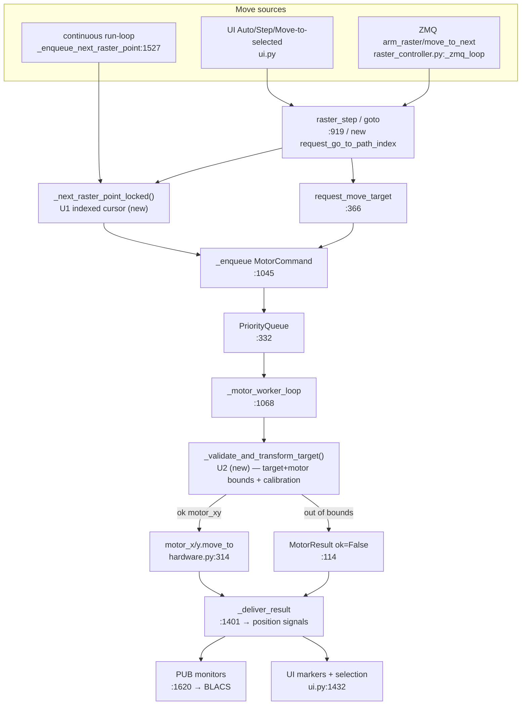

# Unified Architecture Proposal — Rastering Subsystem (Pathfinder 2026-06-09)

Scope of unification is deliberately small. The subsystem is **not** a tangle of
parallel systems — most apparent duplication is legitimate specialization
(planning-time vs enforcement-time, process-isolation caches, Qt emit/dispatch/
update). Only **two** controller-internal duplications are accidental, and both
sit exactly on the work already queued (stepping feature + Display-Bounds fix).
We consolidate those two and stop. No new layers, no flags, no registries.

## U1. One raster cursor (consolidates A1)

**Problem:** `raster_step` (`:919`) and `_enqueue_next_raster_point` (`:1527`)
each do `next(self._raster_iter)` → build `MotorCommand(MOVE_TARGET, tag=
"raster_step")`. The iterator is one-shot, so there is no index to seek — which
also blocks "go to point N."

**Unified component:** an **indexed path model** — `self._raster_path_pts:
List[TargetXY]` + `self._raster_index: int` + one advance helper
`_next_raster_point_locked()` (caller holds `_state_lock`). Materialized once at
`start_raster` via the existing `collect_points(..., max_points=50000)`.

**Single entry point for "advance one point":** `_next_raster_point_locked()`.

| Old call site | Becomes |
|---|---|
| `raster_step:919` `next(it)` | check+advance inside one lock via `_next_raster_point_locked()` |
| `_enqueue_next_raster_point:1527` `next(it)` | same helper |
| `_raster_total_steps` (0 for generators) | `len(_raster_path_pts)` — progress works |
| ZMQ `move_to_next:1757` | unchanged (already delegates to `raster_step`) |

**New capability unlocked:** `select_path_index(n)` / `select_nearest_path_point(x,y)`
(no motion) + `request_go_to_path_index(n)` (motion, tag `move_target`) — the
"go-to-arbitrary-site" feature. **Loss:** none (lazy huge spirals now realize at
arm, capped at 50k — the preview already does this).

## U2. One target validation+transform (consolidates A2, fixes Display Bounds)

**Problem:** `_execute` checks `_within_bounds()` in 4 branches
(`:1205,:1247,:1311,:1336`) with slightly different error text; meanwhile
`set_target_bounds()` is **commented out**, so the Automatic-Controls "Display
Bounds" box is cosmetic and never clamps motion.

**Unified component:** `_validate_and_transform_target(target_xy) ->
(motor_xy, MotorResult|None)` — one pipeline: target-bounds (if set) →
calibration `target_to_motor` → motor-bounds. Returns transformed `motor_xy` or
an error `MotorResult`.

**Single entry point for "is this target legal, and where in motor space":**
`_validate_and_transform_target()`.

| Old call site | Becomes |
|---|---|
| 4× inline bounds+transform in `_execute` | one `_validate_and_transform_target()` call per move branch |
| `set_target_bounds()` (dead) | re-enabled; `_display_bounds` (UI) calls it so the drawn box becomes the enforced `target_bounds` |
| F2 `request_go_to_path_index` | inherits validation for free (same pipeline) |

**Loss:** none. Context-specific error wording is preserved by passing a
`source`/`mode` label. This is a **safety improvement** (motion can no longer
exceed the displayed region).

## Anti-patterns explicitly avoided

- No `PathModel`/`CursorStrategy` class — a `List` + `int` + one helper suffices.
- No config flag to keep the old one-shot iterator — it is fully replaced.
- No bounds-policy registry — one method, straight-line checks.
- Camera-dock `blockSignals` dedup (A3–A8) is **NOT** proposed here: those files
  are rewritten on `feat/spinnaker-gige`; consolidating before that decision is
  wasted effort. Revisit post-camera-decision.

## Combined proposed flow (controller core)

## Implications for the parked-branch decision (session Phase 4)

- **U1+U2 are independent of both parked branches** — they live in
  `raster_controller.py`, which neither `feat/spinnaker-gige` (camera-only) nor
  `zmq-v2-port` (`_zmq_loop` only) restructures. Safe to do on `feat/raster-stepping` now.
- **`feat/spinnaker-gige`** supersedes camera-dock duplication (A3–A8) and fixes
  the live `is_FreezeVideo` failures — strongest near-term value, lowest risk.
- **`zmq-v2-port`** only swaps the transport under F5; it does not change the
  controller API U1/U2 build on. Still blocked by the BLACS-side v2 dependency.
